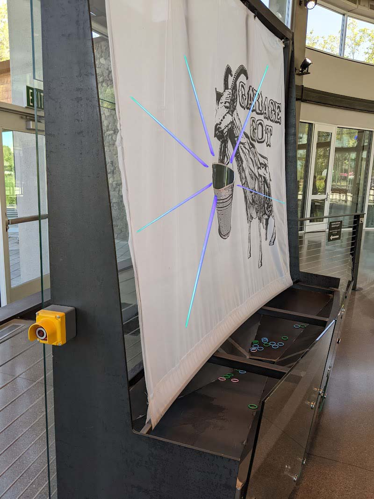

# LoofCarousel.RingTargetDetector
An Arduino project for detecting successful tosses of rings and rewarding the throwers with LED and sound feedback.

## Wokwi

Develop patterns with the [Wokwi project](./wokwi)  

### Intro video:
https://www.loom.com/share/6214540d130b4ce48f3a302fa1ada0d5

## Fastled

see https://github.com/FastLED/FastLED/wiki/Basic-usage

