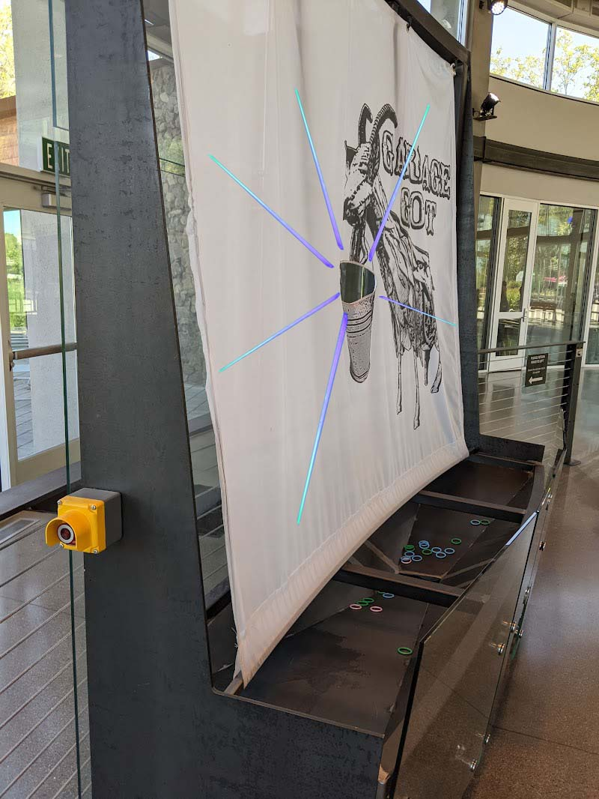
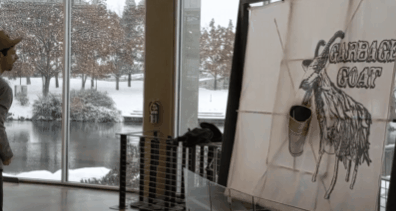

# LooffCarousel.RingTargetDetector
An Arduino project for detecting successful tosses of carousel rings and rewarding the throwers with LED and sound feedback.

## Versions

Two firmware versions are provided, select the one that matches your hardware:

| Folder | Target board | Notes |
| ------ | ------------ | ----- |
| [sketch_esp32](./sketch_esp32) | ESP32 Dev Module (`esp32:esp32:esp32`) | Supported target going forward |
| [sketch_esp8266](./sketch_esp8266) | NodeMCU ESP8266 (`esp8266:esp8266:nodemcuv2`) | Legacy version, kept for existing hardware |

## Hardware (ESP32)

Firmware lives in [./sketch_esp32](./sketch_esp32).

| Signal | GPIO |
| ------ | ---- |
| LED strip 0-5 | 4, 5, 18, 19, 21, 22 |
| Vibration sensor 0 | 16 |
| Vibration sensor 1 | 13 |
| Bell servo | 23 |

## Wokwi

Develop patterns with the [Wokwi project](./Wokwi)  

### Intro video:
https://www.loom.com/share/6214540d130b4ce48f3a302fa1ada0d5

## Fastled

see https://github.com/FastLED/FastLED/wiki/Basic-usage

