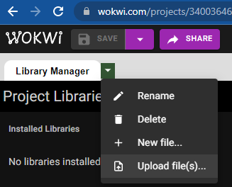

# Pattern Dev with Wokwi Simulator 
## Simulate this project on https://wokwi.com
1. Upload all files in the Wokwi directory to a blank project (use this link for one):
[https://wokwi.com/projects/340036460004508242](https://wokwi.com/projects/340036460004508242)

2. Add all the files from [../sketch_esp8266/src](../sketch_esp8266/src) as well (except the `Patterns` folder in `src`)
3. Code: Create a new file or just re-purpose the ExamplePattern.h which is already wired up to play by default.
4. Put your pattern in [../sketch_esp8266/src/patterns](../sketch_esp8266/src/patterns) and adjust the imports to work with the arduino project structure (reference existing patterns for example) 
5. Create a PR! (include a link to the Wokwi project that you have a running instance of your pattern in)

## Demo video

Demo here of working with Wokwi and this project here: https://www.loom.com/share/6214540d130b4ce48f3a302fa1ada0d5

## Example Fastled Tutorials

Check out the YouTube channel Dave's Garage: https://www.youtube.com/watch?v=r6vMdnqUjTk

## Frame Rates

The LED strips in the configuration we are using max out at about 40 fps or 12.5ms per frame. Instead of having to extra logic in your draw function around fps, when set to have your draw function called every 13ms or less, and the program will convert your 40fps or greater draw function to 40 fps. This means you can make the leds "move" faster without changing logic. 
